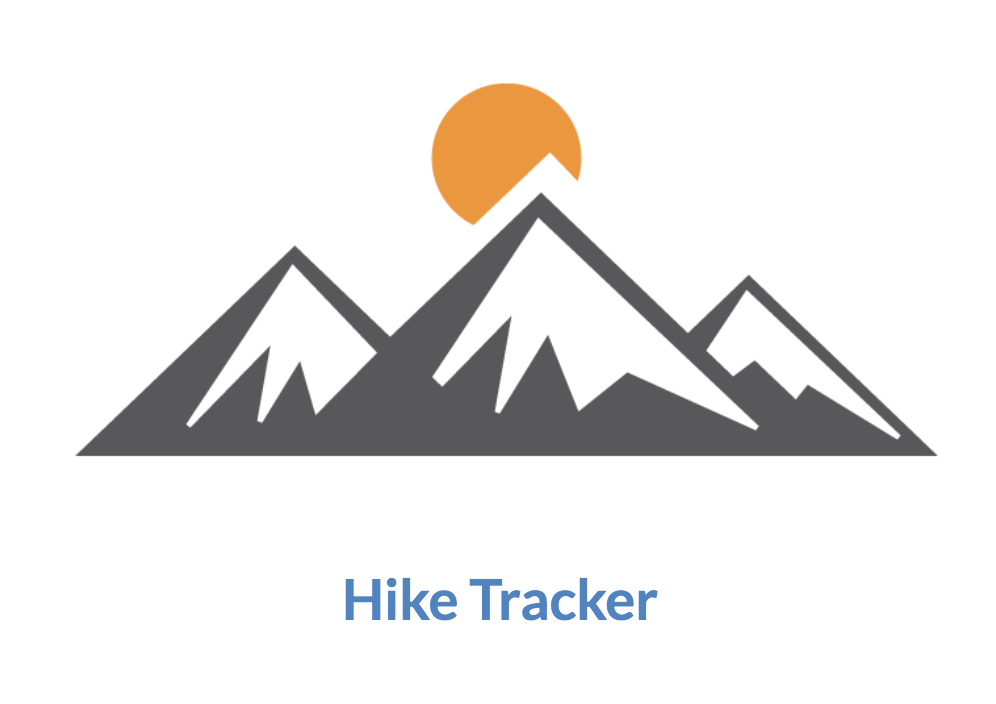

# Hike-Tracker
Hike tracker is a fullstack crud app which allows users to track hikes they have accomplished and rate them.

## Technologies
**Client**
- ReactJS
- React Semantic UI
- Firebase for Deployment

**Server**
- Node
- Express
- Knex
- Postgresql
- Heroku for Deployment

## Challenges
- The main challenge I had was coming up with a proper data schema and structure for the back end. Currently both tables are not connected so you have to track hikes and review them seperately.

-  Since this was my second React project, I had trouble passing props and lifting state back to my app.js so that the CRUD functionality would happened automatically without requiring a hot refresh.

## Future Implementations
- I would like to condense both hike data tables into one and add a users table. With that said, I would like to learn firebase auth so users can sign in and tracker their own hikes and rate them.

- I love minimalsm when it comes to styling, but I would like to play with react semantic UI some more. At this momemnt I do not have a clear direction as to where I want to take it from a UX/UI stand point

## Setup Instructions

To run this project locally:

1. Fork and clone this repo
2. In your command line run: `git clone {your-forked-repo-link}`
3. Run `npm install`

## Contact Author
Christopher Nemeth
cnemeth1@gmail.com

If you would like to contribute please contact me here.

--
MIT License
